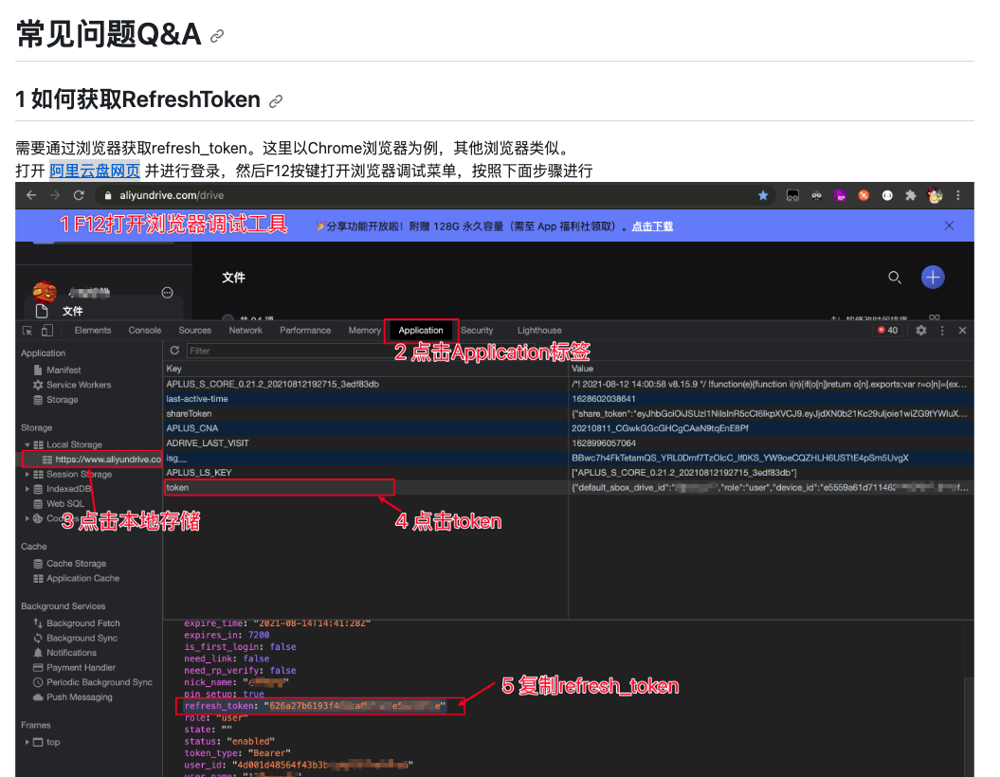

# aliyunpan cli intructions
## installation
```bash
wget https://github.com/tickstep/aliyunpan/releases/download/v0.2.8/aliyunpan-v0.2.8-linux-amd64.zip
unzip aliyunpan-v0.2.8-linux-amd64.zip
cd aliyunpan-v0.2.8-linux-amd64
./aliyunpan
```
https://github.com/aliyun/aliyun-cli

https://github.com/tickstep/aliyunpan/blob/main/docs/manual.md

## configration
```bash
export ALIYUNPAN_CONFIG_DIR=/home/tickstep/tools/aliyunpan/config
```
## get login token, [get refreshtoken](get_token.jpg)


## login
```bash
aliyunpan login -RefreshToken=626a27b6193f4c5ca6ef0.......
#or
aliyunpan login
请输入RefreshToken, 回车键提交 > 626a27b6193f4c5ca6ef0.......
```
## navigation operations
```bash
aliyunpan update
aliyunpan loglist
aliyunpan who
aliyunpan help
```
## download
```bash
aliyunpan config set -savedir <savedir>
download/d path_to_dir_or_file
```
# baidu bypy cli intructions
## install bypy
pip install bypy
## authentication
bypy info ## copy the link into browser and log in to baidu to authenticate (need both password and mobile verification)
## move files to "我的数据应用/bypy/"
## download all files in bypy to local pwd dir
bypy downdir -v

## other useage, go to references
https://mdnice.com/writing/1e33dbfdbbab4fbeba0d4a4632d0208a
https://blog.csdn.net/weixin_42232041/article/details/106816582
