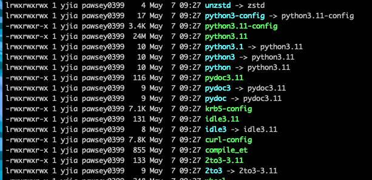

## conda in setonix
https://pawsey.atlassian.net/wiki/spaces/US/pages/101122068/How+to+Configure+Conda+to+Avoid+Quota+Issues
```
## installation
mkdir -p $MYSOFTWARE/miniconda3
wget https://repo.anaconda.com/miniconda/Miniconda3-latest-Linux-x86_64.sh -O $MYSOFTWARE/miniconda3/miniconda.sh
bash $MYSOFTWARE/miniconda3/miniconda.sh -b -u -p $MYSOFTWARE/miniconda3
rm -rf $MYSOFTWARE/miniconda3/miniconda.sh

## add conda initialization to bashrc
export PATH=/software/projects/pawsey0399/yjia/miniconda3/bin/$PATH
source ~/.bashrc
conda init bash
source ~/.bashrc

## cache and cleaning
conda config --add pkgs_dirs /scratch/pawsey0000/user_name/conda_cache
conda clean -af
```
## conda init and conda.sh
```
conda init
. /scratch/pawsey0399/yjia/tools/miniconda3/etc/profile.d/conda.sh
```
## conda add channels
```
#add appropriate channels
conda config --add channels defaults
conda config --add channels bioconda
conda config --add channels conda-forge
```
## install mamba to conda base env
```
conda install -n base mamba
```
## fixes mamba installation for conda
after installing mumba, the default conda envs_dirs changed from /data/tools/miniconda3/envs/ to /data/tools/miniforge3/envs/
Thus, environments located in /data/tools/miniconda3/envs/ could not activated by conda activate name, the fix is:
```bash
conda config --append envs_dirs /data/tools/miniconda3/envs
```
## conda module not found error
https://github.com/conda/conda/issues/9672
```bash
# execute as root in /opt/conda/bin/
unlink python
ln -s python3.5 python
# you should now have python -> python3.5 
```


## conda create Error while loading conda entry point: conda-libmamba-solver (module 'libmambapy' has no attribute 'Context')
conda create -n earlgrey -c conda-forge -c bioconda earlgrey=4.2.4
conda create --solver=classic -n earlgrey -c conda-forge -c bioconda earlgrey=4.2.4 ## add --solver=classic
https://stackoverflow.com/questions/77617946/solve-conda-libmamba-solver-libarchive-so-19-error-after-updating-conda-to-23
