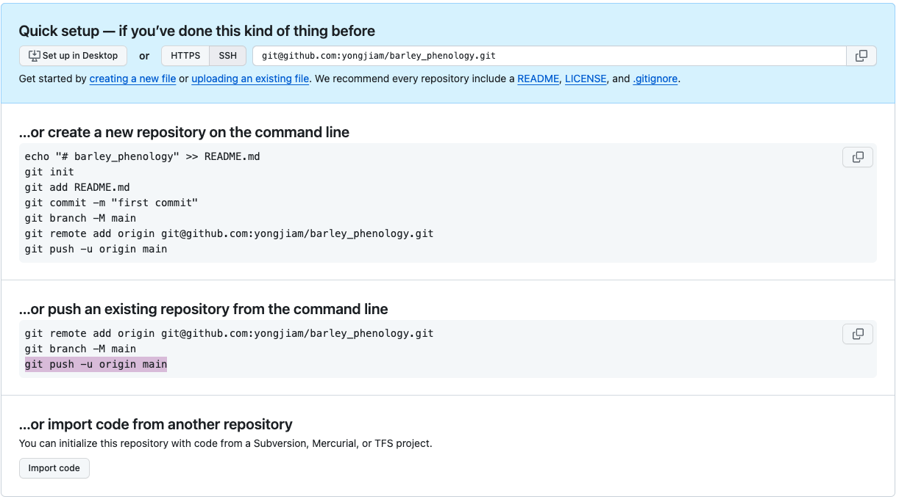

## github push steps:
0. create a new repository in github account

## create ssh keys pairs and use it instead of http
1. check all ssh keys
ls -al ~/.ssh

2. generate ssh key pairs
ssh-keygen -t rsa -b 4096 -C "your_email@example.com"  ## path/to/ssh/keyname

3. add public key to github account
https://docs.github.com/en/github-ae@latest/authentication/connecting-to-github-with-ssh/adding-a-new-ssh-key-to-your-github-account
> click your profile photo, then click Settings \
> In the "Access" section of the sidebar, click  SSH and GPG keys \
> Click New SSH key or Add SSH key \
> In the "Title" field, add a descriptive label for the new key \
> Select the type of key, either authentication or signing \
> In the "Key" field, paste your public key \
> cat ~/.ssh/id_rsa.pub \
> Then select and copy the contents of the id_ed25519.pub file

5. add local key to ssh agent \
ssh-add /path/to/your/private_key

start ssh agent if got error with ssh-add \
eval "$(ssh-agent)"
## setup or push a local github repo

6. initiate local git \
git init

7. check remote url: http or ssh \
git remote -v

8. set remote origin curl as ssh \
git remote set-url origin git@github.com:your_username/your_repository_name.git
git remote add origin git@github.com:yongjiam/barley_phenology.git

10. git clone remote repository \

11. cp or make changes to local git directory \

12. to stage the changes \
git add .

13. registor changes
git commit -m "updates"

14. git push -u origin branch_name(main or master) ## -u flag in the push command (git push -u origin main) sets the upstream branch, but it's only necessary for the first push
or just: git push master/main

15. check local branch names:
git branch

16. create a new branch locally and switch to it:
git checkout -b main

## git push if you deleted and adding new file, when you have files that you do not have locally:
git fetch origin
git pull --rebase origin branch_name
git commit -m "Merge or rebase changes from remote"
git push origin branch_name
