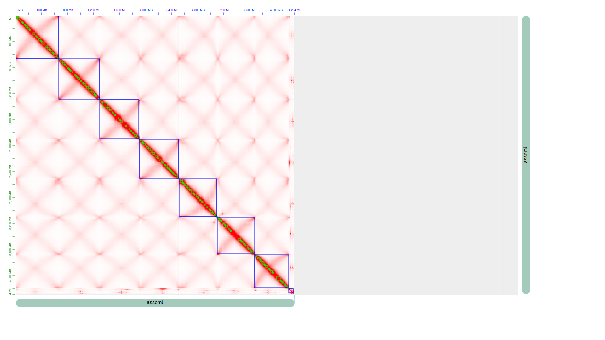

## genome assembly WBT wild barley
### 1.Data
```
-rw-r--r-- 1 yjia pawsey0399 26G Jan 14  2023 WBT_m64268e_230112_082652.hifi_reads.bam
-rw-r--r-- 1 yjia pawsey0399 26G Jan 18  2023 WBT_m64292e_230115_234637.hifi_reads.bam
-rw-r--r-- 1 yjia pawsey0399 25G Jan 19  2023 WBT_m64292e_230117_084848.hifi_reads.bam
-rw-r--r-- 1 yjia pawsey0399 26G Jan 20  2023 WBT_m64292e_230118_175426.hifi_reads.bam

-rw-r--r-- 1 yjia pawsey0399 123G May  3 11:01 Sample_8_WBT_S8_R1_001.trimmed.fq.gz
-rw-r--r-- 1 yjia pawsey0399 128G May  3 11:49 Sample_8_WBT_S8_R2_001.trimmed.fq.gz
```
### 2.Preprocessing
#### trim hic reads
>fastp -i ${R1} -I ${R2} -o ${R1_out} -O ${R2_out} --thread ${SLURM_NTASKS_PER_NODE} --trim_front1 5 --trim_front2 5 --cut_mean_quality 30 --qualified_quality_phred 20 --detect_adapter_for_pe --cut_front --cut_tail --length_required 30 --correction --cut_window_size 5 --overrepresentation_analysis --trim_poly_g -j ${Report_prefix}.fastp.json -h ${Report_prefix}.fastp.html
#### merge hifi fastq from bams
```
cat X201SC22091003-Z01-F004_02.tar.partaa X201SC22091003-Z01-F004_02.tar.partab > merged.tar
tar -xvf merged.tar
conda activate base
srun --export=all -n 1 -c 10 bam2fastq --split-barcodes -o out \
WBT_m64268e_230112_082652.hifi_reads.bam WBT_m64292e_230115_234637.hifi_reads.bam WBT_m64292e_230117_084848.hifi_reads.bam WBT_m64292e_230118_175426.hifi_reads.bam
```
### 3.hifiasm assembling
```
module load samtools/1.15--h3843a85_0
module load singularity/3.11.4-slurm
#srun --export=all -n 1 -c 128  samtools fastq -@ 128 ./ccs/m64257e_211030_130656.ccs.bam > hifi_ccs.fastq
srun --export=all -n 1 -c 64 singularity exec /scratch/pawsey0399/yjia/huyou/containers/hifiasm_latest.sif hifiasm -o wbt.asm -t 64 -l0 \
	--primary \
	--h1 /scratch/pawsey0399/yjia/WBT/Sample_8_WBT_S8_R1_001.trimmed.fq.gz \
	--h2 /scratch/pawsey0399/yjia/WBT/Sample_8_WBT_S8_R2_001.trimmed.fq.gz \
	/scratch/pawsey0399/yjia/WBT/hifi_reads/out.fastq.gz
```
### 4.purge duplication
```
## or install by even in setonix
git clone https://github.com/dfguan/purge_dups.git
cd purge_dups/src && make

## run purge_dups on draft asm
hap_asm=huyou_k19.asm.hic.hap2.p_ctg.fasta
HIFI=hifi_ccs.fastq
HISTPY=/scratch/pawsey0399/yjia/tools/purge_dups/scripts/hist_plot.py
##step1
srun --export=all -n 1 -c 128   minimap2 -xasm20 -t 128 $hap_asm $HIFI | gzip -c - > $HIFI.paf.gz
srun --export=all -n 1 -c 128 pbcstat $HIFI.paf.gz
srun --export=all -n 1 -c 128 calcuts PB.stat > cutoffs 2>calcults.log
####srun --export=all -n 1 -c 128 python3 $HISTPY -c cutoffs PB.stat PB.cov.png ## run this to determine the low, mid, high cutoffs
####srun --export=all -n 1 -c 128 calcuts -l 5 -m 25 -u 204 PB.stat > cutoffs_manual 2>calcults.log
srun --export=all -n 1 -c 128 split_fa $hap_asm > $hap_asm.split
srun --export=all -n 1 -c 128 minimap2 -xasm5 -DP $hap_asm.split $hap_asm.split | gzip -c - > $hap_asm.split.self.paf.gz
##step2
srun --export=all -n 1 -c 128 purge_dups -2 -T cutoffs -c PB.base.cov $hap_asm.split.self.paf.gz > dups.bed 2> purge_dups.log
#####srun --export=all -n 1 -c 128 purge_dups -2 -T cutoffs_manual -c PB.base.cov $hap_asm.split.self.paf.gz > dups.bed 2> purge_dups.log
##step3
srun --export=all -n 1 -c 128 get_seqs -e dups.bed $hap_asm
##step4 Merge hap.fa and $hap_asm and redo the above steps to get a decent haplotig set
```
### 5.hic scaffolding 
#### build singularity image
```
singularity build yjhicpipe.sif docker://yongjia111/yjhicpipe:latest
```
#### nextflow.sh
```
. /opt/conda/etc/profile.d/conda.sh
conda activate hic-scaffolding-nf
export NXF_HOME=/scratch/pawsey0399/yjia/WBT/hifionly/
nextflow run WarrenLab/hic-scaffolding-nf \
    -c /scratch/pawsey0399/yjia/WBT/hifionly/nextflow.config \
    --contigs /scratch/pawsey0399/yjia/WBT/hifionly/wbt_hifionly.asm.p_ctg.fasta \
    --r1Reads /scratch/pawsey0399/yjia/WBT/Sample_8_WBT_S8_R1_001.trimmed.fq.gz \
    --r2Reads /scratch/pawsey0399/yjia/WBT/Sample_8_WBT_S8_R2_001.trimmed.fq.gz \
    --juicer-tools-jar /scratch/pawsey0399/yjia/WBT/juicer_tools_1.22.01.jar \
    --extra-yahs-args "-e GATC"
```
#### nextflow.config
```
process {
    memory = '490 GB'
    time = '1d'

    withName: 'CHROMAP_ALIGN' {
        cpus = 64
        publishDir = [ path: 'out_hifionly/chromap', mode: 'copy' ]
    }
    withName: 'YAHS_SCAFFOLD' { publishDir = [ path: 'out_hifionly/scaffolds', mode: 'copy' ] }
    withName: 'JUICER_PRE' { publishDir = [ path: 'out_hifionly/juicebox_input', mode: 'copy' ] }
    withName: 'PRINT_VERSIONS' { publishDir = [ path: 'out_hifionly/', mode: 'copy' ] }
    withName: 'ASSEMBLY_STATS' { publishDir = [ path: 'out_hifionly/scaffolds', mode: 'copy' ] }
}

profiles {
    lewis {
        process {
            executor = 'slurm'
            queue = 'BioCompute'
            clusterOptions = '--account=warrenlab'
            conda = '/storage/hpc/group/warrenlab/users/esrbhb/mambaforge/envs/chromap-yahs'
        }

        conda.enabled = true

        params {
            juicerToolsJar = '/storage/htc/warrenlab/users/esrbhb/software/juicer_tools_1.11.09_jcuda.0.8.jar'
        }
    }

    conda {
        process.conda = "$baseDir/conda.yml"
        conda.enabled = true
    }
}

manifest {
    defaultBranch = 'main'
    homePage = 'https://github.com/WarrenLab/hic-scaffolding-nf'
    author = 'Edward S. Rice'
    version = '0.0.1'
}
```
#### run hic pipeline
```
##hicpipe.conf
module load singularity/3.11.4-slurm
IMAGE=/scratch/pawsey0399/yjia/WBT/yjhicpipe.sif
srun --export=all -n 1 -c 64 singularity exec $IMAGE bash nextflow.sh
```
WBT Hic_heatmap


## 6.juicerbox manual curation
```
## input
out_JBAT.hic, out_JBAT.assembly
## output
out_JBAT.review.assembly
## changes:
add chr boundary

## juicer post review
###juicer_post_review.sh
. /opt/conda/etc/profile.d/conda.sh
conda activate hic-scaffolding-nf
export NXF_HOME=/scratch/pawsey0399/yjia/WBT/hifionly_run2/
juicer post -o out_JBAT /scratch/pawsey0399/yjia/WBT/hifionly_run2/out_JBAT.review.assembly \
	/scratch/pawsey0399/yjia/WBT/hifionly_run2/work/b0/1f0f7db915bf0a2855204a025e2667/out_JBAT.liftover.agp \
       /scratch/pawsey0399/yjia/WBT/hifionly/wbt_hifionly.asm.p_ctg.fasta

###juicer_post_review.conf
module load singularity/3.11.4-slurm
IMAGE=/scratch/pawsey0399/yjia/WBT/yjhicpipe.sif
srun --export=all -n 1 -c 64 singularity exec $IMAGE bash juicer_post_review.sh
###output
out_JBAT_review.FINAL.fa
```
## 7.genome statistics
### hifi contigs
```
stats for wbt_hifionly.asm.p_ctg.fasta
sum = 4271963213, n = 1838, ave = 2324245.49, largest = 76886278
N50 = 12937035, n = 91
N60 = 9705932, n = 130
N70 = 7090203, n = 182
N80 = 5120947, n = 253
N90 = 2896153, n = 360
N100 = 672, n = 1838
N_count = 0
Gaps = 0
```
### busco contigs
busco.conf
```
#!/bin/bash --login

#SBATCH --job-name=busco
#SBATCH --partition=work
#SBATCH --nodes=1
#SBATCH --ntasks=1
#SBATCH --cpus-per-task=64
#SBATCH --time=6:00:00
#SBATCH --account=pawsey0399
#SBATCH --export=NONE

module load singularity/3.11.4-slurm
BUSCO=/scratch/pawsey0399/yjia/huyou/containers/BUSCO.sif

srun --export=all -n 1 -c 64 singularity exec $BUSCO busco \
	-i /scratch/pawsey0399/yjia/WBT/hifionly/wbt_hifionly.asm.p_ctg.fasta \
	-o wbt_hifionly_busco \
	-m genome \
	-l /scratch/pawsey0399/yjia/huyou/busco/eukaryota_odb10 \
	--cpu 64 \
	--offline
```
results
```
	C:98.4%[S:83.9%,D:14.5%],F:1.2%,M:0.4%,n:255
	251	Complete BUSCOs (C)
	214	Complete and single-copy BUSCOs (S)
	37	Complete and duplicated BUSCOs (D)
	3	Fragmented BUSCOs (F)
	1	Missing BUSCOs (M)
	255	Total BUSCO groups searched

Assembly Statistics:
	1838	Number of scaffolds
	1838	Number of contigs
	4271963213	Total length
	0.000%	Percent gaps
	12 MB	Scaffold N50
	12 MB	Contigs N50
```
## 8.1 gene model projection using gemoma with 10 random wild barley from 76
```
##create gemome references lines
/scratch/pawsey0399/yjia/barley/phase2_annotation/barley_pangenome_annotation_v2.1
cat wild_genome_gff_id_match |while read R1 R2;do echo $(grep $R2 all_gff_id) $(grep $R1 all_genome_id);done > wild_gff_genome_file_id
/scratch/pawsey0399/yjia/barley/phase2_annotation/barley_pangenome_annotation_v2.1/wild_gff_genome_file_id
cat ../wild_gff_genome_file_id|while read R1 R2;do echo "s=own i=$R1 a=$PWD/$R1 g=$PWD/$R2 \\";done > ../gemoma_lines

>>>>>>>>>>> gemoma2.conf
https://www.jstacs.de/index.php/GeMoMa-Docs
GEMOMAP="/scratch/pawsey0399/yjia/tools/gemoma18/GeMoMa-1.8.jar"
srun --export=all -n 1 -c 128 java -Xmx980G -jar $GEMOMAP CLI GeMoMaPipeline threads=128 tblastn=False \
	AnnotationFinalizer.r=SIMPLE AnnotationFinalizer.p=WBT01G AnnotationFinalizer.n=false \
	p=true \
	o=true \
	t=out_JBAT.FINAL.fa \
	outdir=output_gemoma2 \
	s=own i=morex a=/scratch/pawsey0399/yjia/shunlin/morexV3/all.gff3.gz g=/scratch/pawsey0399/yjia/shunlin/morexV3/genome.fasta.gz \
	s=own i=FT11 a=/scratch/pawsey0399/yjia/barley/phase2_annotation/barley_pangenome_annotation_v2.1/wild_genome_gff/B1K-04-12.gff.gz g=/scratch/pawsey0399/yjia/barley/phase2_annotation/barley_pangenome_annotation_v2.1/wild_genome_gff/220812_FT11_pseudomolecules_and_unplaced_contigs_CPclean.fasta.gz

>>>>>>>>>>> gffread
gffread -w transcripts.fa -x cds.fa -y protein.fa -g /path/to/genome.fa final_annotation.gff -F
## process protein.fa
cut -d ';' -f1 protein.fasta | awk '{if ($1 ~ /^>/) $1=">"$2;print $1}' | sed 's/Name=//' > protein_updated.fasta

>>>>>>>>>>>>> interproscan
https://interproscan-docs.readthedocs.io/en/latest/HowToRun.html
wget https://ftp.ebi.ac.uk/pub/software/unix/iprscan/5/5.66-98.0/interproscan-5.66-98.0-64-bit.tar.gz

## set "$JAVA" -XX:ParallelGCThreads=128 -Xms2028M -Xmx980G
INTERPRO=/scratch/pawsey0399/yjia/tools/interproscan-5.66-98.0/interproscan.sh
srun --export=all -n 1 -c 128 bash $INTERPRO -i protein_updated.fasta -goterms -iprlookup -pa -cpu 128

>>>>>>>>>>> integrate interproscan output with gff chromosome position, using funannotate
## install funannotate
mamba create -n funannotate funannotate
## download and setup database
funannotate setup -d $PWD -w
export FUNANNOTATE_DB=/scratch/pawsey0399/yjia/WBT/hifionly_run2/funannotate

## funannotate.conf
conda activate funannotate
export FUNANNOTATE_DB=/scratch/pawsey0399/yjia/WBT/hifionly_run2/funannotate
GENOME=/scratch/pawsey0399/yjia/WBT/hifionly_run2/out_JBAT2_seded_sorted.FINAL.fa
GFF=/scratch/pawsey0399/yjia/WBT/hifionly_run2/output_gemoma3_out_JBAT2_seded_sorted/final_annotation.gff
INTERPRO=/scratch/pawsey0399/yjia/WBT/hifionly_run2/interproscan/protein_updated.fasta.xml
srun --export=all -n 1 -c 128 funannotate annotate --fasta $GENOME --gff $GFF --iprscan $INTERPRO \
    --out output_folder --species "WBT" --cpus 128
```
## 8.2 TE annotation using earlGrey
```
## earlgrey.conf
#!/bin/bash --login

#SBATCH --job-name=earlgrey2
#SBATCH --partition=long
#SBATCH --nodes=1
#SBATCH --ntasks=1
#SBATCH --cpus-per-task=40
#SBATCH --time=96:00:00
#SBATCH --account=pawsey0399
#SBATCH --mem=130G
#SBATCH --export=NONE
module load singularity/3.11.4-slurm
export SINGULARITY_CACHEDIR=/scratch/pawsey0399/yjia/WBT/hifionly_run2/earlgrey/tmp
export IAMGE=/scratch/pawsey0399/yjia/huyou/containers/earlgreydfam38.sif
srun --export=all -n 1 -c 40   singularity exec -B ${PWD}:/data $IMAGE earlgrey.sh

## earlgrey.sh
#!/bin/bash
earlGrey -g /data/out_JBAT2_seded_sorted.FINAL.fa \
        -s wbt2 \
        -o /data/ \
        -r eukarya \
	-d yes \
	-m yes \
        -t 40
```
## 9.genome align compare
```
>>>>>>>>>> ragtag to assign and orient scaffolds to chromosomes (did not work on setonix, use minimap2 directly)
####ragtag.sh
. /opt/conda/etc/profile.d/conda.sh
conda activate ragtag
QUERY1=/scratch/pawsey0399/yjia/WBT/hifionly_run2/out_hifionly/scaffolds/yahs.out_scaffolds_final.fa
REF=/scratch/pawsey0399/yjia/shunlin/morexV3/genome.fasta.gz
ragtag.py scaffold $REF $QUERY1 -t 128 -o ./ragtag_output &> ragtag_log.txt
####ragtag.conf
module load singularity/3.11.4-slurm
srun --export=all -n 1 -c 128 singularity exec docker://yongjia111/yjhicpipe:latest bash ragtag.sh
####output
ragtag.scaffold.fasta, ragtag.scaffold.stats, ragtag.scaffold.asm.paf

>>>>>>>>> minimap2 (use -c 64 to reduce memory) slow on setonix
#!/bin/bash --login

#SBATCH --job-name=minimap
#SBATCH --partition=highmem
#SBATCH --nodes=1
#SBATCH --ntasks=1
#SBATCH --cpus-per-task=64
#SBATCH --time=12:00:00
#SBATCH --account=pawsey0399
#SBATCH --mem=980G
#SBATCH --export=NONE
srun --export=all -n 1 -c 64 minimap2 -x asm5 -t 64 /scratch/pawsey0399/yjia/shunlin/morexV3/genome.fasta out_JBAT.FINAL.fa > morexV3_postview_minimap2.asm.paf

>>>>>>>>>> wfmash (very quick)
module load singularity/3.11.4-slurm
IMAGE=/scratch/pawsey0399/yjia/huyou/containers/ubuntu_wfmash.sif
####### produce quick approximate alignment
srun --export=all -n 1 -c 128 singularity exec $IMAGE /usr/software/wfmash/build/bin/wfmash \
       --threads 128 -n 2 -s 10000 -p 95 -X -k 47 \
       -m /scratch/pawsey0399/yjia/shunlin/morexV3/genome.fasta \
       /scratch/pawsey0399/yjia/WBT/hifionly_run2/out_JBAT2_seded_sorted.FINAL.fa  > morexV3_align_out_JBAT2_seded_sorted.paf
#### perform base pair accurate alignment
srun --export=all -n 1 -c 128 singularity exec $IMAGE /usr/software/wfmash/build/bin/wfmash \
       --threads 128 -n 2 /scratch/pawsey0399/yjia/shunlin/morexV3/genome.fasta \
       /scratch/pawsey0399/yjia/WBT/hifionly_run2/out_JBAT2_seded_sorted.FINAL.fa  > morexV3_align_out_JBAT2_seded_sorted.paf

>>>>>>>>>>>>>syri & plotsr
https://github.com/schneebergerlab/syri
## install syri, plotsr, comes with nucmer
mamba create -n syri_env -c bioconda syri
conda activate syri_env
mamba install -c bioconda plotsr 

## perform whole genome alignment using wfmash, produce sam output
srun --export=all -n 1 -c 128 singularity exec $IMAGE /usr/software/wfmash/build/bin/wfmash \
       --threads 128 -n 2 -a -N /scratch/pawsey0399/yjia/shunlin/morexV3/genome.fasta \ ## use -N not split chromosome for syri need
       /scratch/pawsey0399/yjia/WBT/hifionly_run2/out_JBAT2_seded_sorted.FINAL.fa  > morexV3_align_out_JBAT2_seded_sorted.sam
## Using minimap2 for generating alignment. Any other whole genome alignment tool can also be used.
minimap2 -ax asm5 --eqx refgenome qrygenome > out.sam

## run and plot

```
## Notes
```
minimap2: -k to tune speed at cost of sensitivity, larger k, the faster, default k=15
minimap2: -I split index for every 8G genome, set larger than genome size to avoid split
minimap2: -x create index for genome

wfbash: -m approximate mapping, without -m will perform base-pair alignment
wfbash: -s segment default=5k, -l block size default 5*s
wfbash: -p mapping identity, default 0.90
```
## hic pipe line all in one
```
>>>>>>>>>>>hicpipe.conf
#!/bin/bash --login

#SBATCH --job-name=hic3
#SBATCH --partition=long
#SBATCH --nodes=1
#SBATCH --ntasks=1
#SBATCH --cpus-per-task=128
#SBATCH --time=48:00:00
#SBATCH --account=pawsey0399
#SBATCH --export=NONE

module load singularity/3.11.4-slurm
IMAGE=/scratch/pawsey0399/yjia/WBT/yjhicpipe.sif
srun --export=all -n 1 -c 128 singularity exec $IMAGE bash nextflow.sh

>>>>>>>>>nextflow.sh
. /opt/conda/etc/profile.d/conda.sh
conda activate hic-scaffolding-nf
export NXF_HOME=/scratch/pawsey0399/yjia/WBT/hifionly_run3/
nextflow run main.nf \
    -c /scratch/pawsey0399/yjia/WBT/hifionly_run3/nextflow.config \
    --contigs /scratch/pawsey0399/yjia/WBT/hifionly/wbt_hifionly.asm.p_ctg.fasta \
    --r1Reads /scratch/pawsey0399/yjia/WBT/Sample_8_WBT_S8_R1_001.trimmed.fq.gz \
    --r2Reads /scratch/pawsey0399/yjia/WBT/Sample_8_WBT_S8_R2_001.trimmed.fq.gz \
    --juicer-tools-jar /scratch/pawsey0399/yjia/WBT/juicer_tools_1.22.01.jar \
    --extra-yahs-args "-e GATC"

>>>>>>>> nextflow.config
process {
    memory = '230 GB'
    time = '2d'

    withName: 'CHROMAP_ALIGN' {
        cpus = 128
        publishDir = [ path: 'out_hifionly/chromap', mode: 'copy' ]
    }
    withName: 'YAHS_SCAFFOLD' { publishDir = [ path: 'out_hifionly/scaffolds', mode: 'copy' ] }
    withName: 'JUICER_PRE' { publishDir = [ path: 'out_hifionly/juicebox_input', mode: 'copy' ] }
    withName: 'PRINT_VERSIONS' { publishDir = [ path: 'out_hifionly/', mode: 'copy' ] }
    withName: 'ASSEMBLY_STATS' { publishDir = [ path: 'out_hifionly/scaffolds', mode: 'copy' ] }
}

profiles {
    lewis {
        process {
            executor = 'slurm'
            queue = 'BioCompute'
            clusterOptions = '--account=warrenlab'
            conda = '/storage/hpc/group/warrenlab/users/esrbhb/mambaforge/envs/chromap-yahs'
        }

        conda.enabled = true

        params {
            juicerToolsJar = '/storage/htc/warrenlab/users/esrbhb/software/juicer_tools_1.11.09_jcuda.0.8.jar'
        }
    }

    conda {
        process.conda = "$baseDir/conda.yml"
        conda.enabled = true
    }
}

manifest {
    defaultBranch = 'main'
    homePage = 'https://github.com/WarrenLab/hic-scaffolding-nf'
    author = 'Edward S. Rice'
    version = '0.0.1'
}

>>>>>>>>>>>> main.nf
#!/usr/bin/env nextflow
nextflow.enable.dsl = 2

params.extraYahsArgs = ''

process PRINT_VERSIONS {
    output:
    path("versions.txt")

    """
    echo "Chromap: \$(chromap --version 2>&1)" > versions.txt
    echo "YAHS: \$(yahs --version)" >> versions.txt
    java -jar $params.juicerToolsJar -V | grep Version >> versions.txt
    echo "assembly-stats: \$(assembly-stats -v)" >> versions.txt
    """
}

process SAMTOOLS_FAIDX {
    input:
    path(contigsFasta)

    output:
    path("${contigsFasta}.fai")

    """
    samtools faidx $contigsFasta
    """
}

process CHROMAP_INDEX {
    input:
    path(contigsFasta)

    output:
    path("contigs.index")

    """
    chromap -i -r $contigsFasta -o contigs.index
    """
}

process CHROMAP_ALIGN {
    input:
    path(contigsFasta)
    path(contigsChromapIndex)
    path(r1Reads)
    path(r2Reads)

    output:
    path("aligned.bam")

    """
    chromap \
        --preset hic \
        -r $contigsFasta \
        -x $contigsChromapIndex \
        --remove-pcr-duplicates \
        -1 $r1Reads \
        -2 $r2Reads \
        --SAM \
        -o aligned.sam \
        -t ${task.cpus}

    samtools view -bh aligned.sam | samtools sort -n > aligned.bam
    """
}

process YAHS_SCAFFOLD {
    input:
    path("contigs.fa")
    path("contigs.fa.fai")
    path("aligned.bam")

    output:
    path("yahs.out.bin"), emit: bin
    path("yahs.out_scaffolds_final.agp"), emit: agp
    path("yahs.out_scaffolds_final.fa"), emit: fasta

    """
    yahs $params.extraYahsArgs contigs.fa aligned.bam
    """
}

process JUICER_PRE {
    input:
    path("yahs.out.bin")
    path("yahs.out_scaffolds_final.agp")
    path("contigs.fa.fai")

    output:
    path("out_JBAT.*")

    """
    juicer pre -a -o out_JBAT \
        yahs.out.bin \
        yahs.out_scaffolds_final.agp \
        contigs.fa.fai

    asm_size=\$(awk '{s+=\$2} END{print s}' contigs.fa.fai)
    java -Xmx230G -jar $params.juicerToolsJar \
        pre out_JBAT.txt out_JBAT.hic <(echo "assembly \${asm_size}")
    """
}

process ASSEMBLY_STATS {
    input:
    path("yahs.out_scaffolds_final.fa")

    output:
    path("assembly_stats.txt")

    """
    assembly-stats yahs.out_scaffolds_final.fa > assembly_stats.txt
    """
}

workflow {
    // TODO do a parameter check
    PRINT_VERSIONS()

    r1Reads = Channel.fromPath(params.r1Reads)
    r2Reads = Channel.fromPath(params.r2Reads)
    contigs = Channel.fromPath(params.contigs)

    SAMTOOLS_FAIDX(contigs)
    CHROMAP_INDEX(contigs)

    CHROMAP_ALIGN(contigs, CHROMAP_INDEX.out, r1Reads, r2Reads)

    YAHS_SCAFFOLD(contigs, SAMTOOLS_FAIDX.out, CHROMAP_ALIGN.out)

    JUICER_PRE(YAHS_SCAFFOLD.out.bin, YAHS_SCAFFOLD.out.agp, SAMTOOLS_FAIDX.out)

    ASSEMBLY_STATS(YAHS_SCAFFOLD.out.fasta)
}
```
## run the JUICER_PRE separately
```
find work -name "out_JBAT.hic"
ln -s work/d3/93f68f27a8b4f0e3813cc2c1f472c6/out_JBAT.txt
ln -s /scratch/pawsey0399/yjia/WBT/hifionly_run3/work/e1/2cf8c15664f0e3b932fa151442385f/wbt_hifionly.asm.p_ctg.fasta.fai contigs.fa.fai

## juicer.sh
asm_size=$(awk '{s+=$2} END{print s}' contigs.fa.fai)
JAR=/scratch/pawsey0399/yjia/WBT/juicer_tools_1.22.01.jar
java -Xmx980G -jar $JAR \
        pre out_JBAT.txt out_JBAT.hic assembly ${asm_size}
## juicer.conf
#!/bin/bash --login

#SBATCH --job-name=juicer
#SBATCH --partition=highmem
#SBATCH --nodes=1
#SBATCH --ntasks=1
#SBATCH --cpus-per-task=128
#SBATCH --time=12:00:00
#SBATCH --account=pawsey0399
#SBATCH --mem=980G
#SBATCH --export=NONE

srun --export=all -n 1 -c 128 bash juicer.sh
```
## TE annotation using earlGrey
build, push docker image with conda installation, refer dockerfile
```
#!/bin/bash --login

#SBATCH --job-name=earlgrey3
#SBATCH --partition=work
#SBATCH --nodes=1
#SBATCH --ntasks=1
#SBATCH --cpus-per-task=64
#SBATCH --time=24:00:00
#SBATCH --account=pawsey0399
#SBATCH --mem=230G
#SBATCH --export=NONE

module load singularity/3.11.4-slurm
export SINGULARITY_CACHEDIR=/scratch/pawsey0399/yjia/WBT/hifionly_run2/earlgrey/tmp
srun --export=all -n 1 -c 64   singularity run -B ${PWD}:${PWD} docker://yongjia111/myearlgrey:latest earlgrey.sh

#### earlgrey.sh
#!/bin/bash

. /opt/conda/etc/profile.d/conda.sh
conda activate earlgrey
earlGrey -g ./out_JBAT2_seded_sorted.FINAL.fa \
        -s wbt3 \
        -o ./ \
        -r eukarya \
	-d yes \
	-m yes \
        -t 64
```
## TE annotation using earlGrey with dfam3.8
```
singularity build earlgreydfam38.sif docker://tobybaril/earlgrey_dfam3.8:latest
singularity exec -B $PWD:/data /data/tools/containers/earlgreydfam38.sif earlGrey -g /data/hap1.fasta \
	-s hap1dfam38 -o /data/earlgrey_outputs_hap1 -t 30 -r eukarya -d yes -m yes
```
