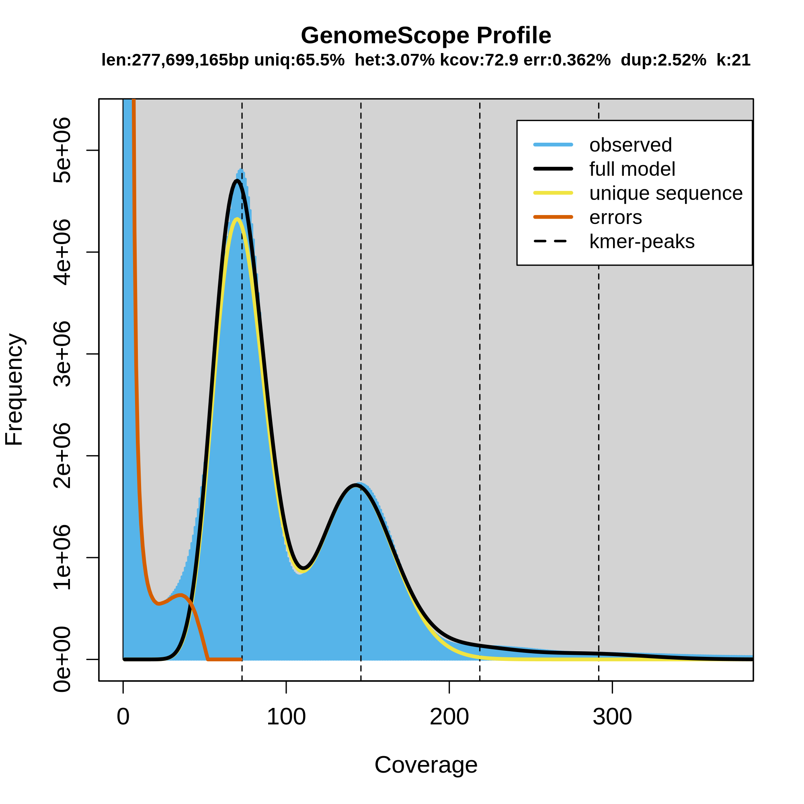
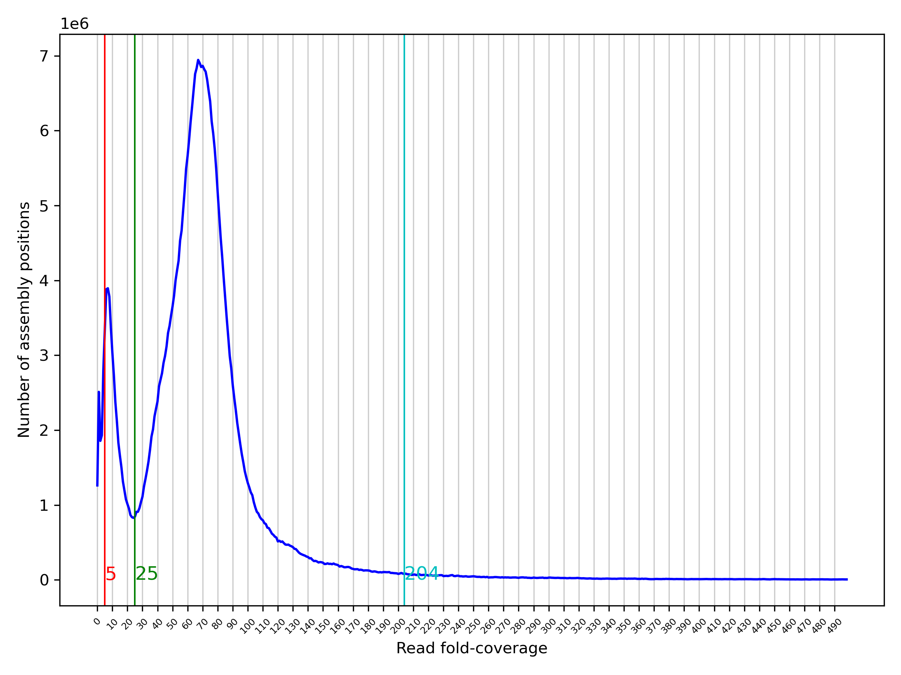
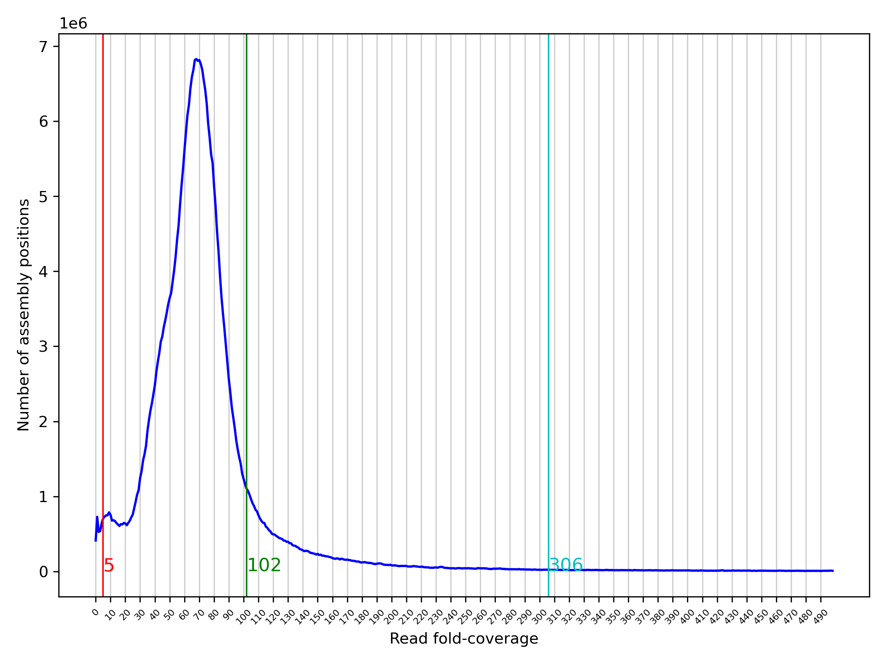

## 1. Data
1. illunina\
   -rw-r--r-- 1 yjia pawsey0399  21G Mar  2 11:37 1_R2.fq.gz\
   -rw-r--r-- 1 yjia pawsey0399  19G Mar  2 11:37 1_R1.fq.gz\
   -rw-r--r-- 1 yjia pawsey0399 9.6K Mar  2 11:37 1.quality.png\
   -rw-r--r-- 1 yjia pawsey0399 6.4K Mar  2 11:37 1.quality.pdf\
   -rw-r--r-- 1 yjia pawsey0399  26K Mar  2 11:37 1.base.png\
   -rw-r--r-- 1 yjia pawsey0399  21K Mar  2 11:37 1.base.pdf\
   
3. hifi\
   -rw-r--r-- 1 yjia pawsey0399 1.5K Mar  2 11:37 m64257e_211030_130656.ccs.subreadset.xml\
   -rw-r--r-- 1 yjia pawsey0399  17M Mar  2 11:37 m64257e_211030_130656.ccs.bam.pbi\
   -rw-r--r-- 1 yjia pawsey0399   64 Mar  2 11:37 m64257e_211030_130656.ccs.bam.md5\
   -rw-r--r-- 1 yjia pawsey0399  21G Mar  2 11:37 m64257e_211030_130656.ccs.bam\
3. HIC\
   -rw-r--r-- 1 yjia pawsey0399 7.7G Mar  2 11:37 changshanhuyou-1_R2.fq.gz\
   -rw-r--r-- 1 yjia pawsey0399 7.3G Mar  2 11:37 changshanhuyou-1_R1.fq.gz\
   -rw-r--r-- 1 yjia pawsey0399  10K Mar  2 11:37 changshanhuyou-1.quality.png\
   -rw-r--r-- 1 yjia pawsey0399 6.5K Mar  2 11:37 changshanhuyou-1.quality.pdf\
   -rw-r--r-- 1 yjia pawsey0399  36K Mar  2 11:37 changshanhuyou-1.base.png\
   -rw-r--r-- 1 yjia pawsey0399  22K Mar  2 11:37 changshanhuyou-1.base.pdf\
4. RNAseq\
   -rwx------ 1 ubuntu ubuntu 2.2G Mar 17 05:00 R1.fq.gz\
   -rwx------ 1 ubuntu ubuntu 2.2G Mar 17 05:01 R2.fq.gz
## 2. Genome assembly
#### run genomescope to assess genome size
```bash
https://github.com/schatzlab/genomescope
https://github.com/gmarcais/Jellyfish

##install jellyfish
sudo apt update
sudo apt install jellyfish ## or conda install kmer-jellyfish
##clone genomescope
git clone https://github.com/schatzlab/genomescope

##run jellyfish and genomescope
GR=/scratch/pawsey0399/yjia/tools/genomescope/genomescope.R
srun --export=all -n 1 -c 64   jellyfish count -C -m 21 -s 3G -t 64 *.fastq -o reads.jf
srun --export=all -n 1 -c 64 jellyfish histo -t 64 reads.jf > reads.histo
srun --export=all -n 1 -c 30 Rscript $GR reads.histo 21 150 output_dir 1000
srun --export=all -n 1 -c 30 Rscript $GR reads.histo 21 150 output_dir10k 10000
srun --export=all -n 1 -c 30 Rscript $GR reads.histo 21 150 output_dir50k 50000
```


#### convert PacBio bam hifi data into fastq
https://github.com/PacificBiosciences/pbtk#bam2fastx
https://github.com/PacificBiosciences/pbbioconda
```bash
## install pbtk
conda install -c bioconda pbtk

## bam to fastq
bam2fastq -o  hifi_ccs.fastq m64257e_211030_130656.ccs.bam
```
#### draft haplotype assembling using hifiasm
https://github.com/chhylp123/hifiasm
https://hifiasm.readthedocs.io/en/latest/interpreting-output.html#interpreting-output
https://hifiasm.readthedocs.io/en/latest/faq.html
https://github.com/chhylp123/hifiasm/issues/55
```bash
#### huyou.conf
#!/bin/bash --login

#SBATCH --job-name=huyou
#SBATCH --partition=highmem
#SBATCH --nodes=1
#SBATCH --ntasks=1
#SBATCH --cpus-per-task=64
#SBATCH --time=24:00:00
#SBATCH --account=pawsey0399
#SBATCH --mem=980G
#SBATCH --export=NONE

module load samtools/1.15--h3843a85_0
module load singularity/3.11.4-slurm
#srun --export=all -n 1 -c 128  samtools fastq -@ 128 ./ccs/m64257e_211030_130656.ccs.bam > hifi_ccs.fastq
srun --export=all -n 1 -c 64 singularity exec --bind ${PWD}:${PWD} hifiasm_latest.sif hifiasm -o huyou.asm -t 64 \
	--h1 ./HIC/changshanhuyou-1_R1.fq.gz \
	--h2 ./HIC/changshanhuyou-1_R2.fq.gz \
	hifi_ccs.fastq

## convert to genome fasta
gfatools gfa2fa huyou.asm.hic.hap1.p_ctg.gfa > hap1.fa
gfatools gfa2fa huyou.asm.hic.hap2.p_ctg.gfa > hap2.fa
awk 'BEGIN {FS="\t"} $1=="S" {print ">"$2"\n"$3}' huyou_hifionly_k19.asm.bp.p_ctg.gfa > huyou_hifionly_k19.asm.bp.p_ctg.fasta

## assembly-stats
conda install bioconda::assembly-stats
conda install bioconda::quast
assembly-stats huyou_hifionly_k19.asm.bp.p_ctg.fasta > huyou_hifionly_k19.asm.bp.p_ctg.stats
##stats for huyou_hifionly_k19.asm.bp.p_ctg.fasta
sum = 381775413, n = 1256, ave = 303961.32, largest = 50382943
N50 = 29086141, n = 6
N60 = 21124568, n = 8
N70 = 15536317, n = 10
N80 = 1534341, n = 14
N90 = 77377, n = 172
N100 = 10838, n = 1256
N_count = 0
Gaps = 0


## sort by sequence length using seqkit
conda install -c bioconda seqkit

seqkit sort -lr hap1.fasta > tmp && mv tmp hap1.fasta
seqkit sort -lr hap2.fasta > tmp && mv tmp hap2.fasta

## seq length check
bioawk -c fastx '{print $name "\t" length($seq)}' genome.fa > chr_length
bioawk -c fastx '{print $name "\t" length($seq)}' huyou.hap1.genome.fa > chr_length1
bioawk -c fastx '{print $name "\t" length($seq)}' huyou.hap2.genome.fa > chr_length2
sed -f sed_id_hap1 chr_length1 > seded_chr_length1
sed -f sed_id_hap2 chr_length1 > seded_chr_length2
```
#### run purge_dups after hifiasm
```bash
https://github.com/dfguan/purge_dups
## install
conda install bioconda::purge_dups
## or install by even in setonix
git clone https://github.com/dfguan/purge_dups.git
cd purge_dups/src && make

## run purge_dups on draft asm
hap_asm=huyou_k19.asm.hic.hap2.p_ctg.fasta
HIFI=hifi_ccs.fastq
HISTPY=/scratch/pawsey0399/yjia/tools/purge_dups/scripts/hist_plot.py
##step1
srun --export=all -n 1 -c 128   minimap2 -xasm20 -t 128 $hap_asm $HIFI | gzip -c - > $HIFI.paf.gz
srun --export=all -n 1 -c 128 pbcstat $HIFI.paf.gz
srun --export=all -n 1 -c 128 calcuts PB.stat > cutoffs 2>calcults.log
####srun --export=all -n 1 -c 128 python3 $HISTPY -c cutoffs PB.stat PB.cov.png ## run this to determine the low, mid, high cutoffs
####srun --export=all -n 1 -c 128 calcuts -l 5 -m 25 -u 204 PB.stat > cutoffs_manual 2>calcults.log
srun --export=all -n 1 -c 128 split_fa $hap_asm > $hap_asm.split
srun --export=all -n 1 -c 128 minimap2 -xasm5 -DP $hap_asm.split $hap_asm.split | gzip -c - > $hap_asm.split.self.paf.gz
##step2
srun --export=all -n 1 -c 128 purge_dups -2 -T cutoffs -c PB.base.cov $hap_asm.split.self.paf.gz > dups.bed 2> purge_dups.log
#####srun --export=all -n 1 -c 128 purge_dups -2 -T cutoffs_manual -c PB.base.cov $hap_asm.split.self.paf.gz > dups.bed 2> purge_dups.log
##step3
srun --export=all -n 1 -c 128 get_seqs -e dups.bed $hap_asm
##step4 Merge hap.fa and $hap_asm and redo the above steps to get a decent haplotig set
```
##### run hist_plot.py to determine the cutoffs manually, which can affect the purged.fa size significantly


```bash
cutoffs: 5	-10	24	25	111	204
stats for purged.fa
sum = 329967642, n = 324, ave = 1018418.65, largest = 46448702
N50 = 21151115, n = 6
N60 = 20684785, n = 7
N70 = 16973329, n = 9
N80 = 12307014, n = 12
N90 = 3899627, n = 16
N100 = 18529, n = 324
N_count = 0
Gaps = 0

manual:  5	24	24	25	25	204
stats for purged.fa
sum = 329967642, n = 324, ave = 1018418.65, largest = 46448702
N50 = 21151115, n = 6
N60 = 20684785, n = 7
N70 = 16973329, n = 9
N80 = 12307014, n = 12
N90 = 3899627, n = 16
N100 = 18529, n = 324
N_count = 0
Gaps = 0
```



```bash
cutoffs: 5	51	85	102	170	306
stats for purged.fa
sum = 297893244, n = 71, ave = 4195679.49, largest = 34263903
N50 = 18773229, n = 6
N60 = 18715694, n = 7
N70 = 16393619, n = 9
N80 = 15371702, n = 11
N90 = 11642485, n = 13
N100 = 10838, n = 71
N_count = 0
Gaps = 0

manual:  5	19	19	20	20	306
stats for purged.fa
sum = 319354012, n = 235, ave = 1358953.24, largest = 34263903
N50 = 18773229, n = 6
N60 = 17307267, n = 8
N70 = 15647065, n = 10
N80 = 12208710, n = 12
N90 = 5353669, n = 16
N100 = 10838, n = 235
N_count = 0
Gaps = 0
```
#### run juicer on draft assembly
https://github.com/aidenlab/juicer/wiki/Installation#dependencies
https://bioinformaticsworkbook.org/dataAnalysis/GenomeAssembly/Hybrid/Juicer_Juicebox_3dDNA_pipeline.html#gsc.tab=0
https://blog.csdn.net/m0_49960764/article/details/118887670
```bash
## install dependencies
conda create --name juicer
conda activate juicer
conda install bioconda::lastz
conda install bioconda::bwa

## install juicer
cd /data/tools/
git clone https://github.com/theaidenlab/juicer.git
mkdir 01_JuicerSetup && cd 01_JuicerSetup
ln -s /data/tools/juicer/CPU scripts

cd scripts/common
wget https://hicfiles.tc4ga.com/public/juicer/juicer_tools.1.9.9_jcuda.0.8.jar
ln -s juicer_tools.1.9.9_jcuda.0.8.jar  juicer_tools.jar

## prepare inputs files
mkdir references && cd references
ln -s /data/huyou/hifiasm_assembly_r2/hap1.fasta hap1.fasta
ln -s /data/huyou/hifiasm_assembly_r2/hap2.fasta hap2.fasta

bwa index hap1.fasta
cd ../
## check for restriction enzyme used at file:///Volumes/Elements5T/Dropbox/Huyou/genome_hic.html
python /data/tools/juicer/misc/generate_site_positions.py DpnII hap1 ./references/hap1.fasta ## produce hap1_DpnII.txt
awk 'BEGIN{OFS="\t"}{print $1, $NF}' hap1_DpnII.txt > hap1.chrom.sizes

mkdir fastq;cd fastq
ln -s /data/huyou/raw_data/HIC/changshanhuyou-1/changshanhuyou-1_R1.fastq.gz hic_R1.fastq.gz ## rename *.fq.gz to *.fastq.gz
ln -s /data/huyou/raw_data/HIC/changshanhuyou-1/changshanhuyou-1_R2.fastq.gz hic_R2.fastq.gz

## run juicer, low memory in nimbus
sudo mkdir /aidenlab && cd /aidenlab
sudo ln -s /data/tools/juicer/CPU scripts
bash /data/tools/juicer/scripts/juicer.sh -g huyou_hap1 -z references/hap1.fasta -y hap1_DpnII.txt -p hap1.chrom.sizes -s DpnII -t 30


########## run juicer in docker
https://github.com/yongjiam/Juicer-Docker
## download test data
   cd /path/to/testdir
   wget https://s3.amazonaws.com/juicerawsmirror/opt/juicer/work/HIC003/fastq/HIC003_S2_L001_R1_001.fastq.gz
   wget https://s3.amazonaws.com/juicerawsmirror/opt/juicer/work/HIC003/fastq/HIC003_S2_L001_R2_001.fastq.gz
   mkdir fastq
   mv HIC003*.fastq.gz fastq

## pull juicer docker image
docker run aidenlab/juicer:latest
docker images

docker run -it -v ${PWD}:/data --entrypoint=/bin/bash aidenlab/juicer:latest ## use entrypoint to stop automatic run
cd /data ## ln softlink not recoganized in docker mount, have to copy files
which juicer.sh ## check the juicer script
mkdir /aidenlab && cd /aidenlab
ln -s /data/tools/juicer/CPU scripts ## the program looks for /aidenlab/scripts/common/countligations.sh: No such file or directory
# Exit the container when you're done
exit

# Get the ID of the container you ran
docker ps -l ## get ID

# Commit the changes to a new Docker image
docker commit b16d1da08f93 aidenlab/juicer:yongjia
singularity build juicer.sif docker-daemon://aidenlab/juicer:yongjia

############ run in docker
### the image was build setting ENTRYPOINT=bash https://www.cloudbees.com/blog/understanding-dockers-cmd-and-entrypoint-instructions
### use -w /data to change the working directory
docker run -v ${PWD}:/data -w /data aidenlab/juicer:yongjia juicer.sh -d /data -g huyou_hap1 -z references/hap1.fasta -y hap1_DpnII.txt -p hap1.chrom.sizes -s DpnII -t 30

### docker stats ## to display running images
### docker stop NAME to stop a docker run

####### run in singularity
### in nimbus
singularity run -B ${PWD}:/data --pwd /data juicer.sif juicer.sh -d /data -g huyou_hap1 -z references/hap1.fasta -y hap1_DpnII.txt -p hap1.chrom.sizes -s DpnII -t 30
### in setonix
#!/bin/bash --login

#SBATCH --job-name=juicer
#SBATCH --partition=highmem
#SBATCH --nodes=1
#SBATCH --ntasks=1
#SBATCH --cpus-per-task=64
#SBATCH --time=24:00:00
#SBATCH --account=pawsey0399
#SBATCH --export=NONE

module load singularity/3.11.4-slurm
srun --export=all -n 1 -c 64 singularity run -B ${PWD}:/data --pwd /data juicer.sif juicer.sh -d /data -g huyou_hap1 -z references/hap1.fasta -y hap1_DpnII.txt -p hap1.chrom.sizes -s DpnII -t 64
```
#### run allhic on draft assembly, alternative to juicer
https://github.com/tangerzhang/ALLHiC/wiki
```bash
##installation
$ git clone https://github.com/tangerzhang/ALLHiC
$ cd ALLHiC
$ chmod +x bin/*
$ chmod +x scripts/*  
$ export PATH=/your/path/to/ALLHiC/scripts/:/your/path/to/ALLHiC/bin/:$PATH

##dependency
samtools v1.9+
bedtools
matplotlib v2.0+

## run_all: index, mapping, 
bwa index -a bwtsw genome.fasta
samtools faidx genome.fasta

bwa aln -t 30 genome.fasta changshanhuyou-1_R1.fastq.gz > sample_R1.sai
bwa aln -t 30 genome.fasta changshanhuyou-1_R2.fastq.gz > sample_R2.sai
bwa sampe genome.fasta sample_R1.sai sample_R2.sai changshanhuyou-1_R1.fastq.gz changshanhuyou-1_R2.fastq.gz > sample.bwa_aln.sam
PreprocessSAMs.pl sample.bwa_aln.sam genome.fasta MBOI
filterBAM_forHiC.pl sample.bwa_aln.REduced.paired_only.bam sample.clean.sam
samtools view -bt genome.fasta.fai sample.clean.sam > sample.clean.bam

##Tips: Details on how to identify allelic contigs can be found in the following link: 
https://github.com/tangerzhang/ALLHiC/wiki/ALLHiC:-identify-allelic-contigs

liftoff -g SWO.v3.0.gene.model.gff3 -o genome.liftoff.gff3 -u genome.unmapped -copies -p 30 genome.fasta SWO.v3.0.genome.fa
mv genome.liftoff.gff3 gmap.gff3
perl gmap2AlleleTable.pl SWO.v3.0.gene.model.gff3 ## modified perl script

ALLHiC_prune -i Allele.ctg.table -b sample.clean.bam -r genome.fasta

ALLHiC_partition -b prunning.bam -r genome.fasta -e AAGCTT -k 9

ALLHiC_rescue -b sample.clean.bam -r draft.asm.fasta -c clusters.txt -i counts_RE.txt


```

## 3. Haplotype scaffolding and genome stats
#### scaffolding using ragtag
https://github.com/malonge/RagTag
```bash
## ragtag.sh
QUERY1=/data/huyou/minimap2_haps/huyou.hap1.genome.fa
QUERY2=/data/huyou/minimap2_haps/huyou_hap2.genome.fa
REF=/data/huyou/company_assembly/03.hic/HiC.review.assembly.chr.fa

ragtag.py scaffold $REF $QUERY1 -t 30 -o ./output_hap1 &> log1.txt
ragtag.py scaffold $REF $QUERY2 -t 30 -o ./output_hap2 &> log2.txt
```
#### genome assessment using busco
download dataset
https://busco-data.ezlab.org/v5/data/lineages/

```bash
#!/bin/bash --login

#SBATCH --job-name=busco
#SBATCH --partition=work
#SBATCH --nodes=1
#SBATCH --ntasks=1
#SBATCH --cpus-per-task=64
#SBATCH --time=12:00:00
#SBATCH --account=pawsey0399
#SBATCH --export=NONE

module load singularity/3.11.4-slurm
BUSCO=/scratch/pawsey0399/yjia/huyou/containers/BUSCO.sif

srun --export=all -n 1 -c 64 singularity exec $BUSCO busco \
	-i /scratch/pawsey0399/yjia/huyou/purge_dups_hifihic_hap1/purged.fa \
	-o hap1_busco \
	-m genome \
	-l /scratch/pawsey0399/yjia/huyou/busco/eukaryota_odb10 \
	--cpu 64 \
	--offline
```

#### count chromosome and contig number for 21 genome data download from http://citrus.hzau.edu.cn/download.php
```bash
ls *.gff3|while read R;do echo $(echo $R|cut -d '.' -f1); echo $(awk '!/^#/{print $1}' $R|sort|uniq|wc -l);done |paste - - > chromosome_count

## chromosome_count
CMJ	10	Citrus_grandis_majiayou
GJ	10	Fortunella_hindsii
HWB	10	Citrus_grandis_wanbaiyou
HZYT	10	Citrus_maxima_huazhouyou
SWO	10	Citrus_sinensis
ZK	10	Poncirus_trifoliata
GCF	94	Citrus_clementina
AEG	138	Aegle_marmelos
MSYG	160	Citrus_mangshanensis
CGI	170	Citropsis_gilletiana
ZGYCC	205	Citrus_ichangensis
HKC	221	Atalantia_buxfoliata
JLX	253	Murraya_paniculata
LW	270	luvunga_scandens
AZM	331	Citrus_australasica
HP	388	Clausena_lansium
XGF	493	Citrus_maxima_majia
HH	501	Citrus_hongheensis
SYT	1001	Luvunga_scandens
JZ	4141	Citrus_reticulata
RL	4465	Citrus_medica
```
#### count chromosome length from gff3 file
```bash
awk '$0 !~ /^#/ {chromosome[$1]=$5} END {for (chr in chromosome) print "Chromosome", chr, ": Total length =", chromosome[chr]}' ./pangenomes/Citrus_changshan-huyou.gene.gff

```

## 4. Gene model prediction 
#### using gemoma (company annotation does not match genome.fa)
reference genomes from phytozome (citrus database data throw errors in gemoma)
```bash
##install gemoma 1.9
conda install -c bioconda gemoma

## run gemoma.sh in setonix
## genome level prediction
GeMoMa GeMoMaPipeline threads=64 tblastn=False \
	AnnotationFinalizer.r=SIMPLE AnnotationFinalizer.p=HY \
	p=false \
	o=true \
	t=./huyou.hap1.genome.fa \
	outdir=hap1/ \
	s=own i=Ccl a=./phytozome/Cclementina_182_v1.0.gene.gff3.gz g=./phytozome/Cclementina_182_v1.fa.gz \
	s=own i=Csi a=./phytozome/Csinensis_154_v1.1.gene.gff3.gz g=./phytozome/Csinensis_154_v1.fa.gz \
	s=own i=Ptr a=./phytozome/Ptrifoliata_565_v1.3.1.gene.gff3.gz g=./phytozome/Ptrifoliata_565_v1.3.fa.gz
```
#### using liftoff (using company annotation)
https://github.com/agshumate/Liftoff
```bash
##install liftoff
conda create --name liftoff
conda install -c bioconda liftoff

## run liftoff.sh in nimbus
liftoff -g huyou.gff -o hap1.liftoff.gff3 \
	-u hap1.unmapped \
	-copies \ ## look for extra copies
	-sc 0.95 \ ## copy identify threshold
	-p 15 \ ##paralel processes
       	huyou.hap1.genome.fa huyou.genome.fa ## target and reference
```
## 5. Orthofinder for 21 citrus species
```bash
## get primary sequence from fasta file
for i in *.protein.fa
do
	VAR=$(echo $i|cut -d "." -f1-2)
	bioawk -c fastx '{if ($name ~ /\.1$/) print ">"$name "\n" $seq}' $i > "primary_"$VAR".protein.fasta"
done

## run orthofinder /data/huyou/orthofinder/
orthofinder -t 30 -f selected
```
## 6. synteny dotplot
1. gene-based
   mcscan
   
   jcvi
   https://github.com/tanghaibao/jcvi
   ```bash
   ## install
   pip install jcvi

   ## gff2bed
   ls *.gff*|while read R;do VAR=$(echo $R|cut -d '.' -f1);python -m jcvi.formats.gff bed --type=mRNA --key=Name --primary_only $R -o $VAR".bed";done ## some gff3 does not have Name, use ID as default
   ## extract cds
   ls *.gff*|while read R;do V=$(echo $R|cut -d '.' -f1);gffread -x $V".cds" -g $V*.genome.fa $R -F;done
   ls *.cds|while read R;do python -m jcvi.formats.fasta format $R "formated_"$R;done

   ##pairwise synteny
   python -m jcvi.compara.catalog ortholog SWO HWB --no_strip_names ##produce anchor file and dotplot by default
   python -m jcvi.compara.catalog ortholog SWO HWB --cscore=.99 --no_strip_names ## 1:1 orthologous region only
   #or
   python -m jcvi.graphics.dotplot SWO.HWB.anchors

   ##multiple species
   python -m jcvi.compara.catalog ortholog huyou SWO --cscore=.99 --no_strip_names
   python -m jcvi.compara.synteny screen --minspan=30 --simple huyou.SWO.anchors huyou.SWO.anchors.new
   
   python -m jcvi.compara.catalog ortholog huyou HWB --cscore=.99 --no_strip_names
   python -m jcvi.compara.synteny screen --minspan=30 --simple huyou.HWB.anchors huyou.HWB.anchors.new

   ## create layout
	   # y, xstart, xend, rotation, color, label, va,  bed
	 .7,     .1,    .8,      15,      , SWO, top, SWO.bed
	 .5,     .1,    .8,       0,      , huyou, top, huyou.bed
	 .3,     .1,    .8,     -15,      , HWB, bottom, HWB.bed
	# edges
	e, 0, 1, huyou.SWO.anchors.simple
	e, 1, 2, huyou.HWB.anchors.simple

   ## modify huyou chr id
	s/chr1/ch5/
	s/chr2/ch3/
	s/chr3/ch2/
	s/chr4/ch8/
	s/chr5/ch9/
	s/chr6/ch7/
	s/chr7/ch4/
	s/chr8/ch1/
	s/chr9/ch6/
   sed -i -f sed_huyou_chr huyou.bed

   ## create seqids
   cut -f1 SWO.bed |sort|uniq|tr '\n' ',' |sed 's/,$/\n/' > seqids
   cut -f1 huyou.bed |sort |uniq|grep chr|tr '\n' ','|sed 's/,$/\n/' >> seqids
   cut -f1 HWB.bed|sort|uniq|tr '\n' ',' |sed 's/,$/\n/' >> seqids

   ## create plot
   python -m jcvi.graphics.karyotype seqids layout   
   ```
2. genome-based
   mummer
   https://www.nature.com/articles/s41588-022-01015-0 \
   ```bash
   git clone https://github.com/mummer4/mummer
   cd mummer && autoreconf -fi
   ./configure --prefix=/data/tools/mybin
   ```
   minimap2
   https://github.com/lh3/minimap2
   ```bash
   ## installation
   git clone https://github.com/lh3/minimap2
   cd minimap2 && make

   ## align two reference genome
   minimap2 -cx asm5 hap1.genome.fa hap2.genome.fa > minimap_aln.paf  # intra-species asm-to-asm alignment

   ## plot the results in R
   ```R
   # install packages
   install.packages("devtools")
   install.packages("pafr")
   install.packages("patchwork")
   install.packages("tidyverse")
   
   # Load necessary libraries
   library(pafr)      # For handling PAF (Pairwise mApping Format) files
   library(patchwork) # For creating composite plots
   library(tidyverse) # For data manipulation and visualization
   # Read the PAF file into a data frame
   df <- read_paf("minimap_aln.paf")
   # Display the first few rows of the data frame
   df %>% as.data.frame() %>% head()

   ####### Create a dotplot visualization from the PAF data
   dotplot(df, order_by='provided',
           ordering= list(c("H2_ch1","H2_ch2","H2_ch3","H2_ch4","H2_ch5","H2_ch6","H2_ch7","H2_ch8","H2_ch9"),
           c("H1_ch1","H1_ch2","H1_ch3","H1_ch4","H1_ch5","H1_ch6","H1_ch7","H1_ch8","H1_ch9")),
           label_seqs = TRUE)
   
   ####### plot each chromosome separately in subplots
   install.packages("gridExtra")
   library(gridExtra)
   # Create an empty list to store the ggplot objects
   plots_list <- list()
   # Loop from 1 to 9
   for (i in 1:9) {
     # Create ggplot for each iteration
       CHR <- paste0("ch", i)
       CHR1 <- paste0("H1_ch", i)
       CHR2 <- paste0("H2_ch", i)
       plot <- dotplot(df, order_by='provided',
               ordering= list(c(CHR2),
               c(CHR1)),
               label_seqs = FALSE) +
       scale_x_continuous(breaks = c(0, 10000000, 20000000, 30000000, 40000000, 45000000), labels = c("0", "10", "20", "30", "40", "45"))+
       scale_y_continuous(breaks = c(0, 10000000, 20000000, 30000000, 40000000, 45000000), labels = c("0", "10", "20", "30", "40", "45"))+
       labs(x = CHR) +
       labs(y = "")
       
     # Name the ggplot object
     plot_name <- paste0("P", i)
     
     # Store the ggplot object in the list
     plots_list[[plot_name]] <- plot
   }
   
   # Arrange plots in a 3x3 grid
   final_plot <- grid.arrange(grobs = plots_list, nrow = 3, ncol = 3)
   ggsave("final_plot.pdf", final_plot, width = 6, height = 6)

   ######### Create a dotplot visualization for a single chromosome from the PAF data
   dotplot(df, order_by='provided',
           ordering= list(c("H2_ch2"),
           c("H1_ch2")),
           label_seqs = TRUE)
   # Create a synteny plot for a specific chromosome pair
   # (Adjust 'q_chrom' and 't_chrom' to match the desired chromosomes)
   plot2 <- plot_synteny(df, q_chrom = "H2_ch2", t_chrom = "H1_ch2", centre = TRUE)
   ggsave("synteny_chr2_plot.pdf", plot2, width = 18, height = 6)

   #############Create a coverage plot, filling based on the query sequences
   plot_coverage(df, fill = "qname")
   
   ############
   ```
   ## Notes: other resources
   https://bioinf.shenwei.me/seqkit/usage/#sort
