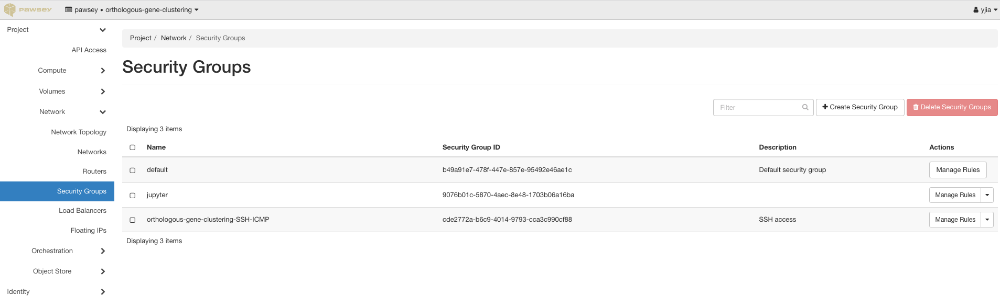

## guide to create a jupyter-lab session on nimbus

## open a port in nimbus dashboard (only for admin)
login to https://nimbus.pawsey.org.au/auth/login/ \


Go to "network > security groups"
Choose security group that attached to your target instance
Click "manage rule" to the right, then "add rule", create both "ingress" and "egress" for a "port"

## login to nimbus server, run jupyter-lab/notebook in a screen session
```bash
screen -ls ## list all screen sessions
screen -r session_name ## attach to a session
ctr+a, d ## deattach a screen session
ctr+d ## kill a screen session
screen -S new_session_name ## create a new screen session
```
## start a jupyter session
```bash
## get public IP for nimbus server
curl ifconfig.me ## such as 146.118.64.19
## start jupyter
jupyter-lab --ip 0.0.0.0 --port PORT_NUM --no-browser --notebook-dir PATH/TO/WHERE/YOU/WANT ## replace PORT_NUM with port number created in nimbus dashboard above
## after the above command, notedown the address with token, such as:
http://127.0.0.1:8888/lab?token=94f74a26d6fe35ba2aa80db0a26ccd9d1f81e638eb220278
## quit your screen session
ctr+a, d
## paste the above address to your browser, replace the 127.0.0.1 with server public IP
http://146.118.64.19:8888/lab?token=94f74a26d6fe35ba2aa80db0a26ccd9d1f81e638eb220278


