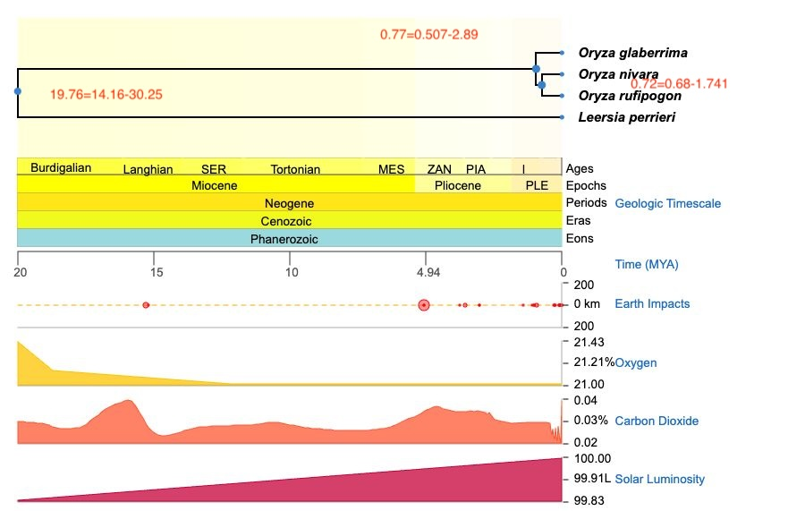

# divergence time dating 
## MCMCtree in PAML
https://cba.anu.edu.au/news-events/events/bayesian-molecular-clock-dating-using-genome-scale-datasets%C2%A0
https://github.com/mariodosreis/divtime
## Step 1 - data preparation
### species tree file with callibration annotation
https://timetree.org/

```
(Lperrieri,(Oglaberrima,((Osindica,Onivara)'>0.28<1.2139',(Osjaponica,(DX50,Orufipogon)))'>0.68<1.741')'>0.507<2.89');
```
### prepare sequence alignment file for single copy gene
[Replace_seqid.ipynb](https://github.com/yongjiam/mytools_usage/blob/main/phylogeny/replace_seqid.ipynb)
###### Protein sequences
```
## grap OG sequences for single copy gene from Orthofinder output
Single_Copy_Orthologue_Sequences/
## for each OG, rename the sequence ID with species ID

from Bio import SeqIO
os.chdir("/data/ricky/mcmctree/Single_Copy_Orthologue_Sequences")
species=["DX50",
"Lperrieri",
"Oglaberrima",
"Onivara",
"Osjaponica",
"Orufipogon",
"Osindica"]

def rename_sequences(fasta_file, species_names):
    records = list(SeqIO.parse(fasta_file, "fasta"))

    for i, record in enumerate(records):
        if i < len(species_names):
            record.id = species_names[i]
            record.description = ""
        else:
            print(f"Warning: More sequences in {fasta_file} than species names provided.")

    SeqIO.write(records, f"renamed_{fasta_file}", "fasta")

if __name__ == "__main__":

    # List of FASTA files
    fasta_files = glob.glob("OG*.fa")

    for fasta_file in fasta_files:
        rename_sequences(fasta_file, species)

## perform sequence alignment using muscle command
ls renamed_OG00*|while read R;do muscle -align $R -output "aligned_"$R;done

## convert aligned fasta to nexus format
ls aligned_renamed_OG00*|while read R;do seqmagick convert --output-format nexus --alphabet protein $R $R".nex";done

## concatenate multiple sequences into a single nexus file
# the combine function takes a list of tuples [(name, nexus instance)...],
# if we provide the file names in a list we can use a list comprehension to
# create these tuples

nexi = []
file_list = glob.glob("*.nex")

nexi = [(fname, Nexus.Nexus(fname)) for fname in file_list]

combined = Nexus.combine(nexi)

with open("combined.nexus", "w") as f:
    combined.write_nexus_data(filename=f)
```
##### CDS sequences
```
### single copy gene ID matrix: updated_single-copy-OG-ID.txt
### extract the sequence ID for each OG
cat updated_single-copy-OG-ID.txt |while read -r -a fields; do key="${fields[0]}"; values=("${fields[@]:1}"); output_file="${key}.txt"; printf "%s\n" "${values[@]}" > "$output_file"; done

### extract the sequences for each OG
ls OG*.txt|while read R;do blastdbcmd -db merged_cds -entry_batch $R -out $R".fasta";done

### rename sequence ID with species ID
[Replace_seqid.ipynb]

### codon-based alignment
usage: seqmagick backtrans-align [-h] [-o destination_file] [-t {standard,standard-ambiguous,vertebrate-mito}] [-a {fail,warn,none}] protein_align nucl_align

Given a protein alignment and unaligned nucleotides, align the nucleotides using the protein alignment.
Protein and nucleotide sequence files must contain the same number of sequences, in the same order, with the same IDs.

seqmagick backtrans-align protein_align.fas nucl_align.fasta -o nucl_align.fas

## convert aligned cds fasta to nexus format
ls aligned_renamed_OG00*|while read R;do seqmagick convert --output-format nexus --alphabet protein $R $R".nex";done

## concatenate multiple sequences into a single nexus file
# the combine function takes a list of tuples [(name, nexus instance)...],
# if we provide the file names in a list we can use a list comprehension to
# create these tuples

nexi = []
file_list = glob.glob("*.nex")

nexi = [(fname, Nexus.Nexus(fname)) for fname in file_list]

combined = Nexus.combine(nexi)

with open("combined.nexus", "w") as f:
    combined.write_nexus_data(filename=f)
```

## Step 2 - run mcmctree
#### mordify mcmctree control file to change scale from 100Mya to 1Mya
###### mcmctree.ctl with clock = 2
```
          seed = -1
       **seqfile = combined_all.nexus**
      **treefile = species_tree_time.trees**
      mcmcfile = mcmc.txt
       outfile = out.txt

         ndata = 1
       **seqtype = 2**    * 0: nucleotides; 1:codons; 2:AAs
       **usedata = 3**    * 0: no data; 1:seq like; 2:normal approximation; 3:out.BV (in.BV)
         clock = 2    * 1: global clock; 2: independent rates; 3: correlated rates
       RootAge = '<30.25'  * safe constraint on root age, used if no fossil for root.

         model = 0    * 0:JC69, 1:K80, 2:F81, 3:F84, 4:HKY85
         alpha = 0    * alpha for gamma rates at sites
         ncatG = 5    * No. categories in discrete gamma

     cleandata = 0    * remove sites with ambiguity data (1:yes, 0:no)?

       **BDparas = .01 .01 0.1**  * birth, death, sampling ## changed due to scale from 100Myr to 1Myr
   kappa_gamma = 6 2      * gamma prior for kappa
   alpha_gamma = 1 1      * gamma prior for alpha

   **rgene_gamma = 2 2000 1**   * gammaDir prior for rate for genes ## changed due to scale
  sigma2_gamma = 1 10 1   * gammaDir prior for sigma^2     (for clock=2 or 3)

      finetune = 1: .1 .1 .1 .1 .1 .1 * auto (0 or 1): times, musigma2, rates, mixing, paras, FossilErr

         print = 1   * 0: no mcmc sample; 1: everything except branch rates 2: everything
        burnin = 2000
      sampfreq = 10
       nsample = 20000
 *** Note: Make your window wider (100 columns) before running the program.
```
###### first run
```
## some sequence does not have two spaces between sequence name and sequence
sed -i -E 's/Oglaberrima[[:space:]]+/Oglaberrima  /' combined_all.nexus

## run mcmctree
mcmctree mcmctree.ctl

## remove files
rm out.BV rst

## modify tmp0001.ctl
seqfile = tmp0001.txt
treefile = tmp0001.trees
outfile = tmp0001.out
noisy = 3
seqtype = 2
**model = 2**
**aaRatefile = wag.dat**
**fix_alpha = 0
alpha = .5
ncatG = 4**
Small_Diff = 0.1e-6
getSE = 2
method = 1

## run codeml
codeml tmp0001.ctl
```
#### mordify mcmctree.ctl usedata=2, normal approximation
```
          seed = -1
       seqfile = combined_all.nexus
      treefile = species_tree_time.trees
      mcmcfile = mcmc.txt
       outfile = out.txt

         ndata = 1
       seqtype = 2    * 0: nucleotides; 1:codons; 2:AAs
       **usedata = 2**    * 0: no data; 1:seq like; 2:normal approximation; 3:out.BV (in.BV)
         clock = 2    * 1: global clock; 2: independent rates; 3: correlated rates
       RootAge = '<30.25'  * safe constraint on root age, used if no fossil for root.

         model = 0    * 0:JC69, 1:K80, 2:F81, 3:F84, 4:HKY85
         alpha = 0    * alpha for gamma rates at sites
         ncatG = 5    * No. categories in discrete gamma

     cleandata = 0    * remove sites with ambiguity data (1:yes, 0:no)?

       **BDparas = .01 .01 0.1**  * birth, death, sampling ## changed due to scale from 100Myr to 1Myr
   kappa_gamma = 6 2      * gamma prior for kappa
   alpha_gamma = 1 1      * gamma prior for alpha

   rgene_gamma = 2 2000 1   * gammaDir prior for rate for genes ## changed due to scale
  sigma2_gamma = 1 10 1   * gammaDir prior for sigma^2     (for clock=2 or 3)

      finetune = 1: .1 .1 .1 .1 .1 .1 * auto (0 or 1): times, musigma2, rates, mixing, paras, FossilErr

         print = 1   * 0: no mcmc sample; 1: everything except branch rates 2: everything
        burnin = 2000
      sampfreq = 10
       nsample = 20000
 *** Note: Make your window wider (100 columns) before running the program.
```
###### second run mcmctree
```
mcmctree mcmctree.ctl
```

